[](https://img.shields.io/badge/license-MIT-blue.svg)
[](http://makeapullrequest.com)
[](http://www.repostatus.org/#active)

# Description

This package provides widgets for Spec (Pharo Smalltalk UI description framework).

# Installation

## Stable version

Through command-line using [PI](https://github.com/hernanmd/pi):

```bash
pi install SpecUIAddOns
```

In Pharo Smalltalk

[//]: # (pi)
```smalltalk
Metacello new	
  baseline: 'SpecUIAddOns';	
  repository: 'github://hernanmd/SpecUIAddOns/repository';	
  load.
```

## Development version

Through command-line using [PI](https://github.com/hernanmd/pi):

```bash
pi --dev install SpecUIAddOns
```

## Baseline String

If you want to add the ProjectFramework to your Metacello Baselines or Configurations, copy and paste the following expression:

```smalltalk
	" ... "
	spec
		baseline: 'SpecUIAddOns' 
		with: [ spec repository: 'github://hernanmd/SpecUIAddOns/repository' ];
	" ... "
```

# Screenshots

## Editable List

Provides a List with add, edit and remove items behavior. Add and edit buttons are automatically selected or deselected depending on current selection. 

Operation buttons can be placed on top:

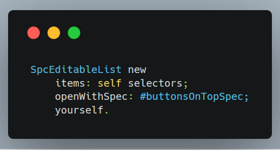

Operation buttons can be placed on bottom:

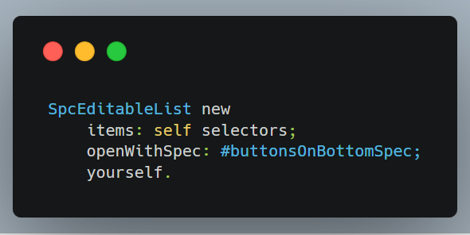

Widget with buttons on top and no items selected:

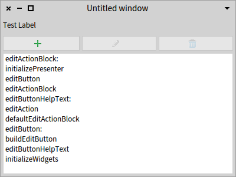

Widget with buttons on bottom and item selected:

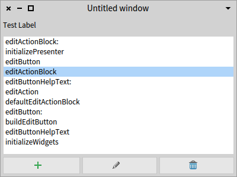

## Labeled TextArea

TextArea code:

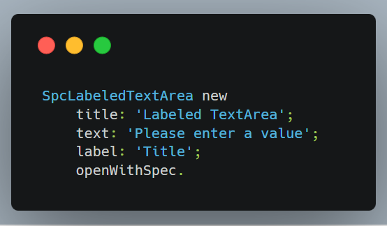

TextArea widget:

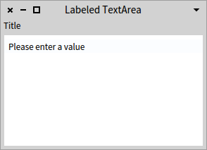

## Labeled TextField with Button

TextField with an action button code:

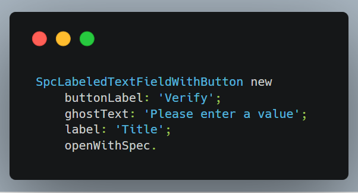

TextField with action button widget:

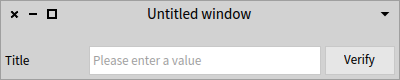

## Double Selector List

Provides two lists, two list acting as master-detail and a third one with items associated to the detail list.

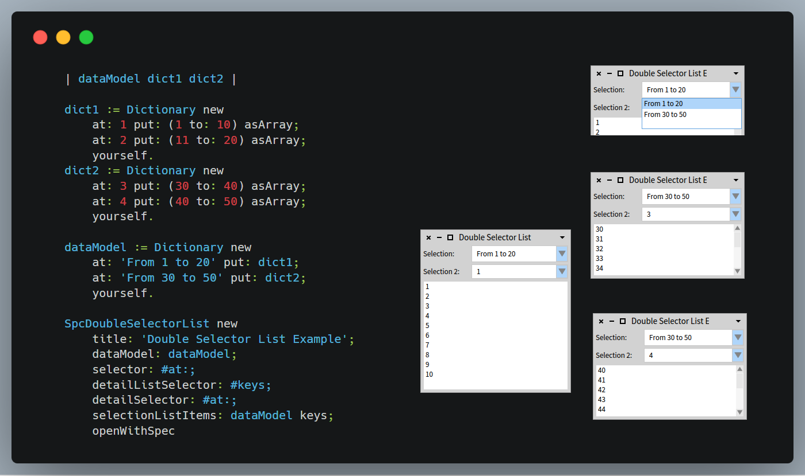

## Toolbar with Buttons

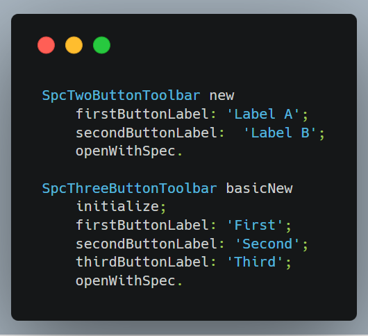

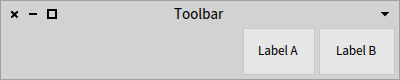

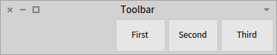

## TextField in Wizard

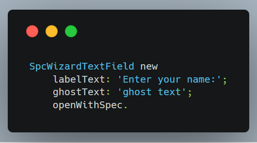

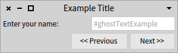

## Radio Button in Wizard

Provides vertically aligned radio buttons:

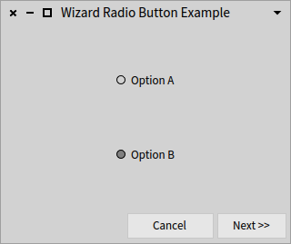

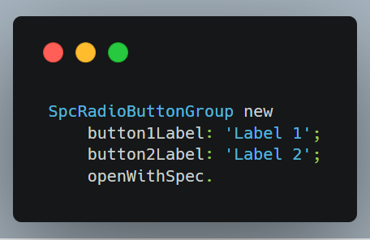

## TextField Selector

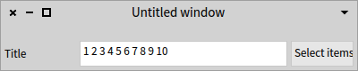

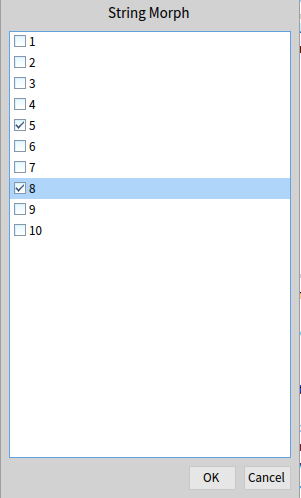

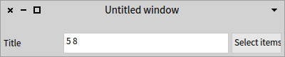

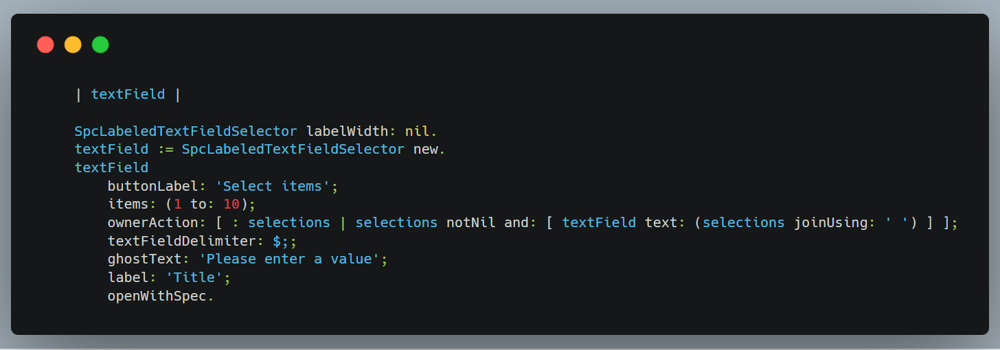

## Searchable List

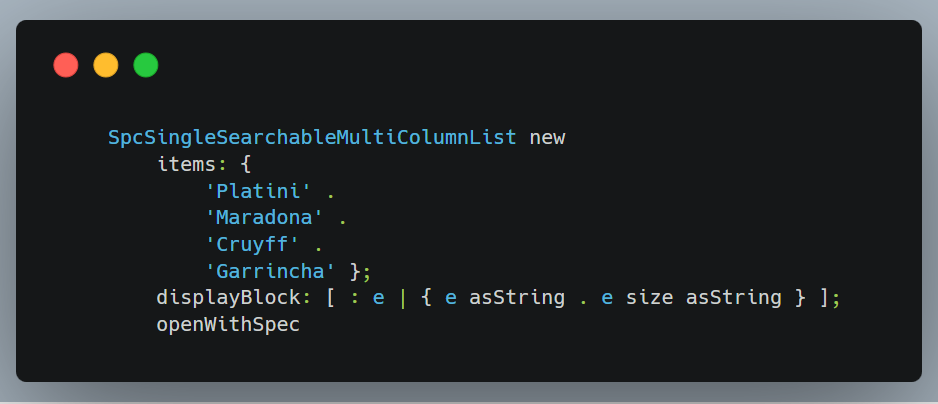

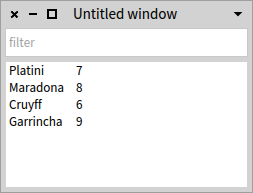

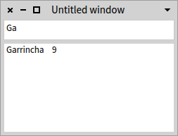

## TextField with Browse Button

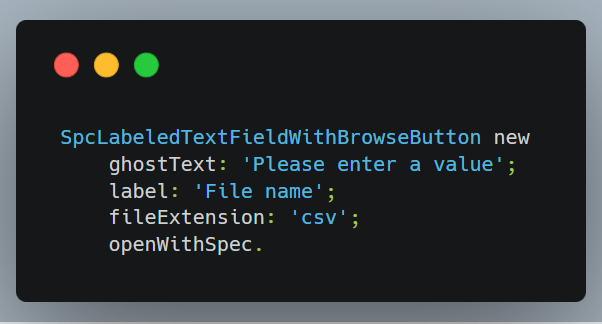

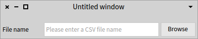

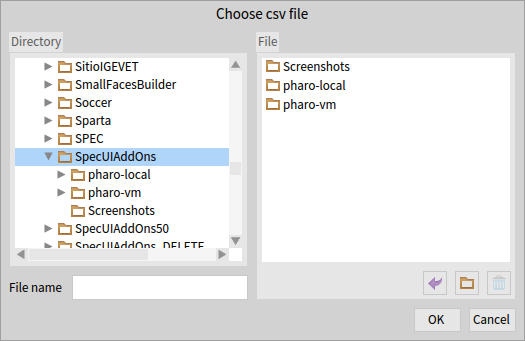

## Growable search list

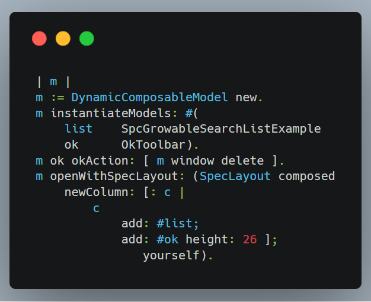

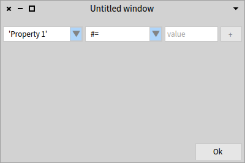

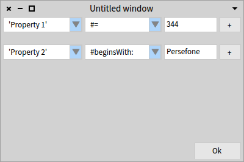


# Usage notes

  - It requires you already have some experience building Spec user-interfaces.
    - Most widgets can be used by composition (i.e.: in the #instantiateModels: inside your #initializeWidgets). Some other widgets are intended to be subclassed.
  - The SpecUIAddOns classes begins with Spc prefix.
  - Most widgets implements example methods in the class side, category "examples"

# Contribute

**Working on your first Pull Request?** You can learn how from this *free* series [How to Contribute to an Open Source Project on GitHub](https://egghead.io/series/how-to-contribute-to-an-open-source-project-on-github)

If you have discovered a bug or have a feature suggestion, feel free to create an issue on Github.

If you'd like to make some changes yourself, see the following:    

  - Fork this repository to your own GitHub account and then clone it to your local device
  - Do some modifications
  - Test.
  - Add <your GitHub username> to add yourself as author below.
  - Finally, submit a pull request with your changes!
  - This project follows the [all-contributors specification](https://github.com/kentcdodds/all-contributors). Contributions of any kind are welcome!

# License
	
This software is licensed under the MIT License.

Copyright Hernán Morales Durand, 2018.

Permission is hereby granted, free of charge, to any person obtaining a copy of this software and associated documentation files (the "Software"), to deal in the Software without restriction, including without limitation the rights to use, copy, modify, merge, publish, distribute, sublicense, and/or sell copies of the Software, and to permit persons to whom the Software is furnished to do so, subject to the following conditions:

The above copyright notice and this permission notice shall be included in all copies or substantial portions of the Software.

THE SOFTWARE IS PROVIDED "AS IS", WITHOUT WARRANTY OF ANY KIND, EXPRESS OR IMPLIED, INCLUDING BUT NOT LIMITED TO THE WARRANTIES OF MERCHANTABILITY, FITNESS FOR A PARTICULAR PURPOSE AND NONINFRINGEMENT. IN NO EVENT SHALL THE AUTHORS OR COPYRIGHT HOLDERS BE LIABLE FOR ANY CLAIM, DAMAGES OR OTHER LIABILITY, WHETHER IN AN ACTION OF CONTRACT, TORT OR OTHERWISE, ARISING FROM, OUT OF OR IN CONNECTION WITH THE SOFTWARE OR THE USE OR OTHER DEALINGS IN THE SOFTWARE.

# Authors

Hernán Morales Durand

